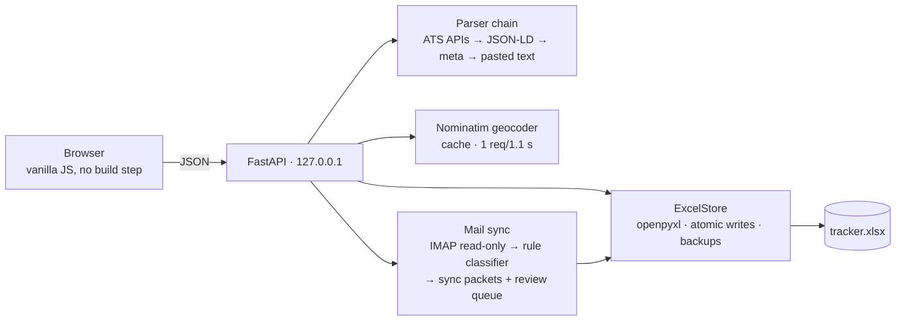

# Application Tracker

Local-first job application tracker. Paste a posting URL — company, title, location, and sponsorship signals are prefilled from the posting itself. Your data lives in a plain Excel workbook on your disk. No accounts, no cloud, no cost.

I built this in the middle of my own job search: a hundred-plus applications across two countries had outgrown my spreadsheet, but I didn't want to abandon the spreadsheet — so I grew a product around it. Everything here exists because I needed it that week.

**[Live demo](https://jamie-dongjae.github.io/application-tracker/)** — a static build with fictional sample data. The demo simulates the mail sync and serves canned parsing results; the real features need the app running locally.


## Features

- **One-field add** — paste a job URL; the server resolves it through a parser chain: ATS JSON APIs (Greenhouse, Lever, Ashby, Workable, Recruitee, SmartRecruiters, Workday) → schema.org JSON-LD → OpenGraph/meta heuristics. Every prefilled value carries a provenance chip; nothing saves without your review.
- **Blocked-site fallback** — LinkedIn and Indeed refuse robots. The app detects the authwall and parses a pasted job description locally instead, including visa-sponsorship mentions with the matching quote as evidence.
- **A pipeline that matches reality** — four stages: Wishlist → Applied → Interview → Offer, then a real ending: **accept, decline, reject, or withdraw**. One-click buttons on every card (advance / reject / withdraw, and accept / decline once an offer lands — accepting earns a proper gold-confetti fanfare), drag-and-drop, a closed tray holding all four outcomes, and undo for everything.
- **A hyperreal globe** — applications pinned on a satellite Earth floating in a starfield (MapLibre globe projection + atmosphere over Esri World Imagery), entered with a cinematic space-to-Earth descent. Real 3D elevation (AWS Open Data Terrarium DEM + hillshading) makes mountains rise when you tilt, and the zoom now runs all the way from orbit to street-level rooftops with Esri's reference labels and roads. Every tile service is keyless and free with attribution — no API keys, no watermarks. Locations are geocoded once via OpenStreetMap Nominatim (cached, rate-limited, free) and stored as coordinates in the workbook; remote roles are listed, never pinned to fake spots, and unmapped rows get a one-click fix.
- **Insights** — an [Apache ECharts](https://echarts.apache.org)-powered dashboard built for a real search: source effectiveness (which channels actually lead to screens), weekly cohorts (is the CV improving — screen rate per week applied), rejection-speed distribution (same-batch ATS cuts vs. slow human reviews), a 7-stage funnel, closed-outcome and gate breakdowns, a GitHub-style daily-activity calendar, weekly momentum vs. your goal, and a response-rate gauge. Computed from your data; nothing is estimated. ECharts 5.6.0 is vendored in `static/vendor/` so it all works offline.
- **One-click mail sync** — the ✉ Sync button reads your Gmail over IMAP (app password, read-only, nothing is ever marked read or sent) and applies only mechanically certain updates: ATS confirmations and template rejections on unambiguous matches. Anything that needs judgment — interview invites, redirects, visa language — lands in a review queue on the dashboard with per-item Apply/Dismiss. A provenance ledger keyed on Gmail message ids makes every sweep idempotent. See [Mail sync](#mail-sync).
- **A categorization layer that survives rejection-heavy searches** — beyond the four kanban stages, every application carries a `track` (career / bridge / lottery / referral / inbound / nurture), a monotonic 7-step `stage_reached` funnel, a `current_state`, a typed `outcome` (ATS cut vs. CV screen vs. after-interview…), gate flags (visa, language, seniority), a next action with a due date, and a per-application event timeline. The kanban status is derived from these fields, so the two views can never disagree.
- **Interview prep bank** — questions and answers, grouped by category.
- **Excel is the database** — open `tracker.xlsx` in Excel any time. External edits are detected and reloaded; if the file is open in Excel during a save you get a clear banner instead of a corrupt file. Atomic writes plus rolling backups in `data/backups/`.
- Command palette (⌘K), keyboard-first navigation, dark/light themes, mute toggle.

| Pipeline | Map |
|---|---|
|  |  |

| Add flow | Insights |
|---|---|
|  |  |

## Quick start

Requires Python ≥ 3.10.

**The easy way** — clone (or download) the repo, then:

- **macOS**: double-click **`start.command`** (first time: right-click → Open if macOS asks)
- **Windows**: double-click **`start.bat`**

The first launch builds its own environment in about a minute; every launch after that just opens the app in your browser. If it's already running, the launcher simply brings it up again.

**The terminal way:**

```bash
git clone https://github.com/jamie-dongjae/application-tracker && cd application-tracker
python3 -m venv .venv && source .venv/bin/activate
pip install -r requirements.txt
python run.py
```

Either way the server binds to `127.0.0.1` only — nothing is exposed to the network.

**You don't need to bring any Excel file.** On first run the app creates `data/tracker.xlsx` with the right sheets and columns, and every change you make is saved into it. It stays an ordinary workbook you can open, sort, and filter in Excel. Optional: `python scripts/make_sample_data.py` fills it with 30 fictional rows to explore first.

## Mail sync

The ✉ Sync button connects to Gmail over IMAP with a Google **app password** — no cloud project, no OAuth dance:

1. Turn on 2-Step Verification for your Google account, then create an app password at [myaccount.google.com/apppasswords](https://myaccount.google.com/apppasswords). (If that page says the setting isn't available, check that "Skip password when possible" is off under *Security → How you sign in to Google*.)
2. Click **✉ Sync** in the app; paste your address and the 16-character password into the connect dialog. The server verifies the login before saving anything.

What it does — and deliberately doesn't do:

- Reads mail since the last sync, **read-only** (`BODY.PEEK`, mailbox opened read-only): nothing gets marked read, moved, or sent.
- Auto-applies only template-certain signals (application-received confirmations, template rejections) on unambiguous company + role matches. Everything else goes to the dashboard review queue for your decision.
- The credential lives in `data/gmail_credentials.json` with `0600` permissions, gitignored, on your machine only. Delete it any time via `DELETE /api/sync/mail/credentials` or by removing the file.

## Data model

The workbook's Applications sheet carries both the simple kanban `status` and a richer categorization; the status is always derived from the richer fields, so they can't drift apart:

| field | values | meaning |
|---|---|---|
| `track` | career · bridge · lottery · referral · inbound · nurture | why this application exists (bridge/nurture are excluded from pipeline KPIs) |
| `stage_reached` | applied → confirmed → recruiter_screen → assessment → hiring_manager → final → offer | furthest funnel point; monotonic, never lowered |
| `current_state` | awaiting_response · awaiting_decision · scheduling · action_required · on_hold_employer · stale · closed | what is true right now |
| `outcome` | rejected_ats · rejected_cv · rejected_after_screen · rejected_after_interview · rejected_visa · rejected_language · redirected · withdrawn_by_me · role_closed · void | only when closed |
| `gates` | free flags (`no_sponsorship`, `dutch_required`, `years_gap`, …) | known blockers on the posting |
| `next_action` + `due` | free text + date | powers the dashboard due list |

Two extra sheets: **Events** (a dated timeline per application, shown in the detail drawer) and **Employers** (per-company rules like "one active application at a time"). See [docs/ARCHITECTURE.md](docs/ARCHITECTURE.md) for the sync-packet format external tools can POST.

## Configuration & troubleshooting

- `TRACKER_DATA_DIR` env var relocates the whole data directory; `TRACKER_XLSX` points at a specific workbook. Neither is required.
- The server binds the first free port from `8765` upward, `127.0.0.1` only. A singleton lock (`/tmp/application-tracker.lock`) makes double-launches defer to the running instance.
- **Workbook open in Excel?** Saves return a clear 409 banner instead of corrupting the file — close the workbook and retry.
- **App looks stale after an update?** The server sends `no-cache` for all modules, so a normal reload always gets fresh code. One hard refresh (⌘⇧R) clears anything cached before that policy existed.
- More in [docs/SETUP.md](docs/SETUP.md).

## Already tracking in a spreadsheet?

```bash
python scripts/import_legacy.py --in "/path/to/Old_Tracker.xlsx"
```

The importer finds your header row by column-name aliases (Company, Job Title, Status, Location, URL…), coerces dates, canonicalizes statuses, and never modifies your source file. Then run **Geocode unmapped locations** from the command palette to pin imported rows on the map.

## Your data vs. the demo

Everything under `data/` (your workbook, caches, backups) is gitignored and never leaves your machine — CI fails the build if a workbook ever lands in the repo. The [live demo](https://jamie-dongjae.github.io/application-tracker/) is a fully static build with fictional sample data; the real app is what you run locally.

## Architecture



Deeper docs: [SETUP](docs/SETUP.md) · [ARCHITECTURE](docs/ARCHITECTURE.md) · [CONTRIBUTING](docs/CONTRIBUTING.md)

Five runtime dependencies: `fastapi`, `uvicorn`, `openpyxl`, `httpx`, `selectolax`. The frontend is plain ES modules — no bundler, no node_modules. Sounds are synthesized with WebAudio (no audio files); motion (staggered entrances, KPI count-ups, kanban Flip glides) by [GSAP](https://gsap.com) — the app degrades gracefully if its CDN is unreachable and respects `prefers-reduced-motion`. Satellite imagery © Esri, Maxar, Earthstar Geographics; labels by [CARTO](https://carto.com/attributions)/OpenStreetMap; rendering by MapLibre GL.

## Development

```bash
pip install -e ".[dev]"
pytest
```

All tests run offline against committed fixtures (real ATS payload shapes, JSON-LD pages, authwall pages, pasted job descriptions). CI runs on Python 3.10 and 3.12. Older workbooks (v2 schema: five-stage pipeline, salary columns, STAR prep) upgrade in place automatically on first load.

## License

[MIT](LICENSE)
