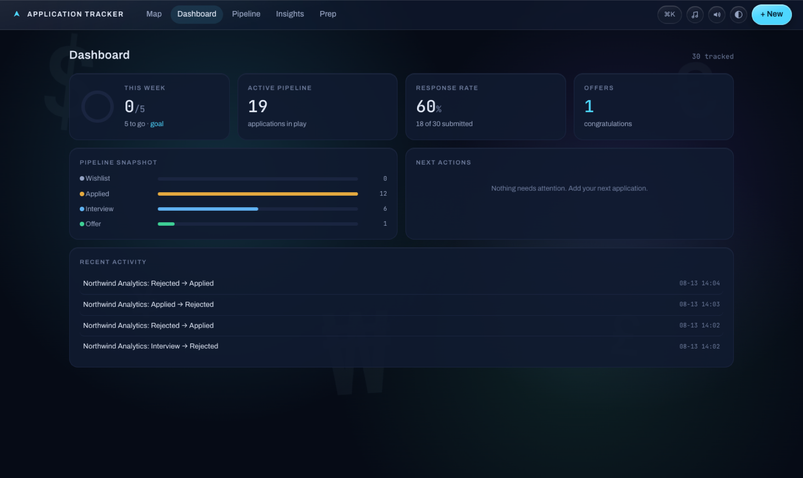
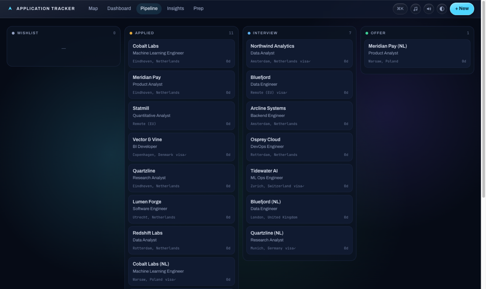
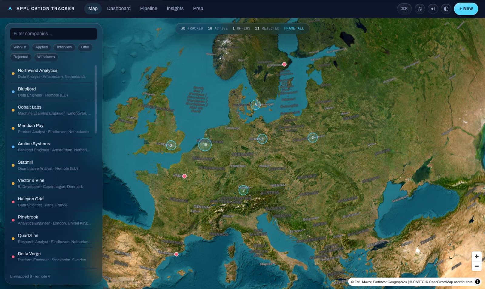
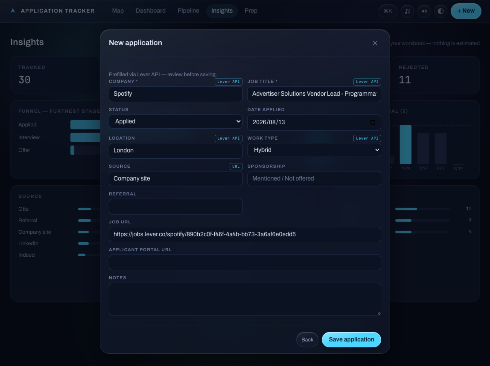
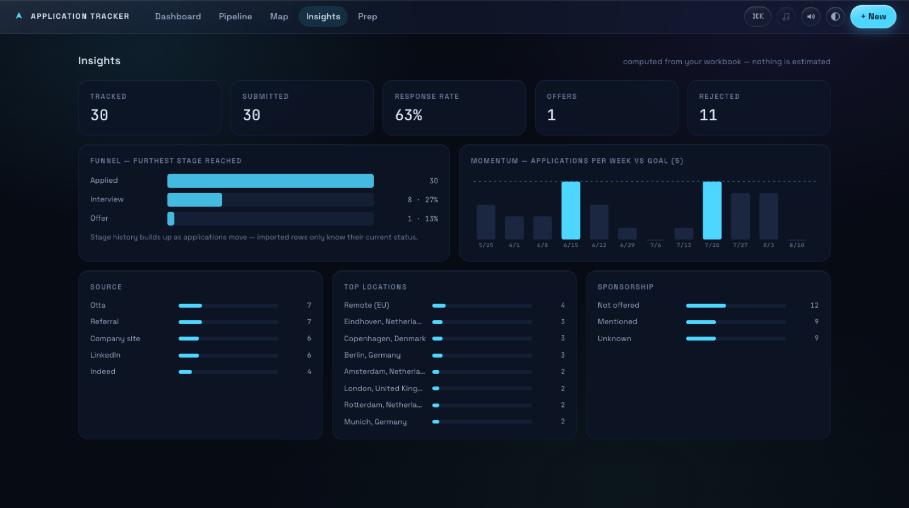
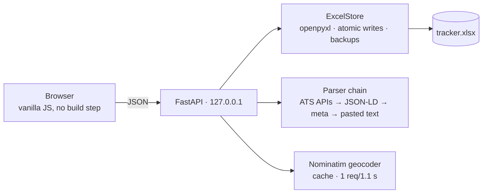

# Application Tracker

Local-first job application tracker. Paste a posting URL — company, title, location, and sponsorship signals are prefilled from the posting itself. Your data lives in a plain Excel workbook on your disk. No accounts, no cloud, no cost.




## Features

- **One-field add** — paste a job URL; the server resolves it through a parser chain: ATS JSON APIs (Greenhouse, Lever, Ashby, Workable, Recruitee, SmartRecruiters, Workday) → schema.org JSON-LD → OpenGraph/meta heuristics. Every prefilled value carries a provenance chip; nothing saves without your review.
- **Blocked-site fallback** — LinkedIn and Indeed refuse robots. The app detects the authwall and parses a pasted job description locally instead, including visa-sponsorship mentions with the matching quote as evidence.
- **A pipeline that matches reality** — four stages: Wishlist → Applied → Interview → Offer, with a closed tray for rejections. One-click **advance / reject buttons on every card** (with sound and a small celebration when an offer lands), drag-and-drop, and undo for everything.
- **Accurate map** — locations are geocoded once via OpenStreetMap Nominatim (cached, rate-limited, free) and stored as coordinates in the workbook. Remote roles are listed, never pinned to fake spots; unmapped rows are shown honestly with a one-click fix.
- **Insights** — response rate, Applied → Interview → Offer funnel (history-aware), weekly momentum vs. your goal, and source/location/sponsorship breakdowns. Computed from your data; nothing is estimated.
- **Interview prep bank** — questions and answers, grouped by category.
- **Excel is the database** — open `tracker.xlsx` in Excel any time. External edits are detected and reloaded; if the file is open in Excel during a save you get a clear banner instead of a corrupt file. Atomic writes plus rolling backups in `data/backups/`.
- Command palette (⌘K), keyboard-first navigation, dark/light themes, mute toggle.

| Pipeline | Map |
|---|---|
|  |  |

| Add flow | Insights |
|---|---|
|  |  |

## Quick start

Requires Python ≥ 3.10.

```bash
git clone https://github.com/OWNER/application-tracker && cd application-tracker
python3 -m venv .venv && source .venv/bin/activate
pip install -r requirements.txt
python run.py
```

That's it — the server starts on `127.0.0.1` and opens your browser.

**You don't need to bring any Excel file.** On first run the app creates `data/tracker.xlsx` with the right sheets and columns, and every change you make is saved into it. It stays an ordinary workbook you can open, sort, and filter in Excel. Optional: `python scripts/make_sample_data.py` fills it with 30 fictional rows to explore first.

## Already tracking in a spreadsheet?

```bash
python scripts/import_legacy.py --in "/path/to/Old_Tracker.xlsx"
```

The importer finds your header row by column-name aliases (Company, Job Title, Status, Location, URL…), coerces dates, canonicalizes statuses, and never modifies your source file. Then run **Geocode unmapped locations** from the command palette to pin imported rows on the map.

## Your data vs. the demo

Everything under `data/` (your workbook, caches, backups) is gitignored and never leaves your machine — CI fails the build if a workbook ever lands in the repo. The [live demo](https://OWNER.github.io/application-tracker/) is a fully static build with fictional sample data; the real app is what you run locally.

## Architecture



Five runtime dependencies: `fastapi`, `uvicorn`, `openpyxl`, `httpx`, `selectolax`. The frontend is plain ES modules — no bundler, no node_modules. Sounds are synthesized with WebAudio (no audio files); motion (staggered entrances, KPI count-ups, kanban Flip glides) by [GSAP](https://gsap.com) — the app degrades gracefully if its CDN is unreachable and respects `prefers-reduced-motion`. Map tiles by [CARTO](https://carto.com/attributions)/OpenStreetMap, rendering by MapLibre GL.

## Development

```bash
pip install -e ".[dev]"
pytest
```

All tests run offline against committed fixtures (real ATS payload shapes, JSON-LD pages, authwall pages, pasted job descriptions). CI runs on Python 3.10 and 3.12. Older workbooks (v2 schema: five-stage pipeline, salary columns, STAR prep) upgrade in place automatically on first load.

## License

[MIT](LICENSE)
