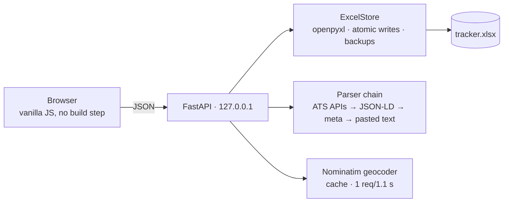

# Waypoint

Local-first job application tracker. Paste a posting URL — company, title, location, salary, and sponsorship signals are prefilled from the posting itself. Your data lives in a plain Excel workbook on your disk. No accounts, no cloud, no cost.


## Why

Tracking applications by hand means retyping the same fields for every posting, and spreadsheet-only tracking gives you no pipeline view, no map, no momentum. Waypoint keeps the spreadsheet — openable, portable, yours — and adds the product around it.

## Features

- **One-field add** — paste a job URL; the server resolves it through a parser chain: ATS JSON APIs (Greenhouse, Lever, Ashby, Workable, Recruitee, SmartRecruiters, Workday) → schema.org JSON-LD → OpenGraph/meta heuristics. Every prefilled value carries a provenance chip; nothing saves without your review.
- **Blocked-site fallback** — LinkedIn and Indeed refuse robots. Waypoint detects the authwall and parses a pasted job description locally instead (title, company, location, salary incl. `€4.500 per maand` → yearly, sponsorship mentions with the matching quote as evidence).
- **Pipeline board** — drag applications across stages; changes save to the workbook instantly, with undo.
- **Accurate map** — locations are geocoded once via OpenStreetMap Nominatim (cached, rate-limited, free) and stored as coordinates in the workbook. Remote roles are listed, never pinned to fake spots. Unmapped rows are shown honestly with a one-click fix.
- **Insights** — response rate, stage funnel (history-aware), weekly momentum vs. your goal, time-in-stage, source/sponsorship/location breakdowns. Computed from your data; nothing is estimated.
- **Interview prep bank** — STAR-format answers grouped by category.
- **Excel is the database** — open `tracker.xlsx` in Excel any time. Waypoint detects external edits and reloads; if the file is open in Excel during a save, you get a clear banner instead of a corrupt file. Atomic writes plus rolling backups in `data/backups/`.
- Command palette (⌘K), keyboard-first navigation, dark/light themes.

| Pipeline | Map |
|---|---|
|  |  |

| Add flow | Insights |
|---|---|
|  |  |

## Quick start

Requires Python ≥ 3.10.

```bash
git clone https://github.com/OWNER/waypoint && cd waypoint
python3 -m venv .venv && source .venv/bin/activate
pip install -r requirements.txt
python scripts/make_sample_data.py   # optional: 30 fictional rows to explore with
python run.py                        # starts the server and opens your browser
```

`run.py` binds to `127.0.0.1` only. Your workbook is created at `data/tracker.xlsx` (`--xlsx` / `--data-dir` to relocate). Delete the sample workbook and add your first real application whenever you're ready.

## Migrating an existing spreadsheet

```bash
python scripts/import_legacy.py --in "/path/to/Old_Tracker.xlsx"
```

The importer detects header rows by column-name aliases, coerces dates (ISO strings, Excel serials, `d/m/Y`), canonicalizes statuses, and never touches the source file. Then run **Geocode unmapped locations** from the command palette to pin imported rows.

## Architecture



Five runtime dependencies: `fastapi`, `uvicorn`, `openpyxl`, `httpx`, `selectolax`. The frontend is plain ES modules — no bundler, no node_modules. Map tiles by [CARTO](https://carto.com/attributions)/OpenStreetMap, rendering by MapLibre GL.

## Privacy

- Everything runs and stays on your machine; the only outbound calls are the job URL you paste, Nominatim geocoding, and CDN assets (map tiles, fonts).
- `data/` and `*.xlsx` are gitignored, and CI fails if a workbook ever lands in the repo.
- The [live demo](https://OWNER.github.io/waypoint/) is fully static with fictional sample data.

## Development

```bash
pip install -e ".[dev]"
pytest
```

All 80+ tests run offline against committed fixtures (real ATS payload shapes, JSON-LD pages, authwall pages, pasted JDs). CI runs on Python 3.10 and 3.12.

## License

[MIT](LICENSE)
